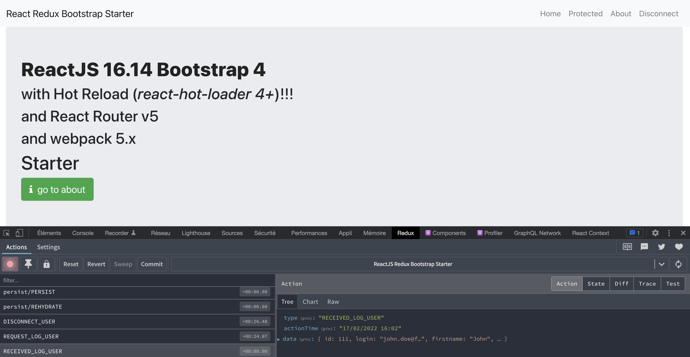

# React 16.9+ (Typescript) React-Router 4 + Redux + Bootstrap + Webpack 4 with Hot Reload and redux-devtools-extension STARTER

[](https://github.com/MacKentoch/react-redux-bootstrap-webpack-starter)
[](https://travis-ci.org/MacKentoch/react-redux-bootstrap-webpack-starter)
[](https://coveralls.io/github/MacKentoch/react-redux-bootstrap-webpack-starter?branch=master)

> My best React + redux project starter.

- _webpack is as simple as possible_
- _ReactJS is written with `optimization tricks` (stateless, hooks, pure render, PureComponent...)._
- _`pure front-end` = server independant (use whatever you want as server: NodeJS, Rails, .NET...)_
- `SPA` but `SEO` and/or `PWA` friendly since use of `dynamic imports` and `application snapshot`.

_Concept behind:_ same as [react-bootstrap-webpack-starter](https://github.com/MacKentoch/react-bootstrap-webpack-starter) **but added `Redux` and amazing and helpful [redux-devtools-extension](https://github.com/zalmoxisus/redux-devtools-extension#redux-devtools-extension).**


[](https://app.fossa.io/projects/git%2Bgithub.com%2FMacKentoch%2Freact-redux-bootstrap-webpack-starter?ref=badge_shield)

## Detailed Content

**Front:**

- Typescript
- React JS (16.9+ - [github :link:](https://github.com/facebook/react))
- Redux (_as you application grows managing state will be a serious concern, save pain with Redux_)
- React-Redux (_Redux is not specific to ReactJS, you could easily use it with Angular2 for instance_)
- redux-devtools-extension ([github :link:](https://github.com/zalmoxisus/redux-devtools-extension#redux-devtools-extension))
- connected-react-router 4 ([github :link:](https://github.com/supasate/connected-react-router))
- react-router (4.x- [github :link:](https://github.com/reactjs/react-router))
- Bootstrap (4.x - [github :link:](https://github.com/twbs/bootstrap))
- reactstrap ([github :link:](https://github.com/reactstrap/reactstrap))
- loadable-components - work with reactsnap for better static website performance - (_stuck to pre v2.2.3+ breakings changes, waiting for a new solution see [PR](https://github.com/stereobooster/react-snap/pull/338/commits/adf107b4bff212a854a93e2d90f89d369433a807)_)
- font-awesome ([github :link:](https://github.com/FortAwesome/Font-Awesome))
- animate.css ([github :link:](https://github.com/daneden/animate.css))
- classnames ([github :link:](https://github.com/JedWatson/classnames))
- react-motion ([github :link:](https://github.com/chenglou/react-motion))
- Webpack 4.x ([github :link:](https://github.com/webpack/webpack))
- axios ([github :link:](https://github.com/mzabriskie/axios) _Why: simple, complete, isomorphic ..._)

**Tool chain:**

- Typescript
- eslint
- webpack 4
- hot reload
- loaders
  - `ts` / `tsx`
  - css
  - json
  - images formats
  - svg and fonts formats

**tests:**

- Jest
- enzyme

## Changelog

[Here](./CHANGELOG.md)

## Usage

### Install

```bash
# from root directory:
cd front && yarn install
```

### bundle dev mode (_+ redux-devtools_)

```bash
# from root directory:
cd front && yarn run dev
```

### dev : hot reload mode (_+ redux-devtools_)

```bash
# from root directory:
cd front && yarn run start
```

### tests

```bash
# from root directory:
cd front && yarn run test
```

### bundle production mode

```bash
# from root directory:
cd front && yarn run prod
```

### mini node-express server

⚠️Ensure having bundled the application before (result is in `_ROOT_DIR_/docs` directory), then:

```bash
# from root directory:

# install dependencies the first time only:
cd server && yarn install
# run the server:
yarn run run-server # this will serve ROOT/docs content!
```

## Donate

Do you use & like react-redux-bootstrap-webpack-starter but you don’t find a way to show some love?
If yes, please consider donating to support this project. Otherwise, no worries, regardless of whether there is support or not, I will keep maintaining this project. Still, if you buy me a cup of coffee I would be more than happy though 😄

[](https://www.paypal.me/ErwanDatin/)

## License

The MIT License (MIT)

Copyright (c) 2019 Erwan DATIN

Permission is hereby granted, free of charge, to any person obtaining a copy of this software and associated documentation files (the "Software"), to deal in the Software without restriction, including without limitation the rights to use, copy, modify, merge, publish, distribute, sublicense, and/or sell copies of the Software, and to permit persons to whom the Software is furnished to do so, subject to the following conditions:

The above copyright notice and this permission notice shall be included in all copies or substantial portions of the Software.

THE SOFTWARE IS PROVIDED "AS IS", WITHOUT WARRANTY OF ANY KIND, EXPRESS OR IMPLIED, INCLUDING BUT NOT LIMITED TO THE WARRANTIES OF MERCHANTABILITY, FITNESS FOR A PARTICULAR PURPOSE AND NONINFRINGEMENT. IN NO EVENT SHALL THE AUTHORS OR COPYRIGHT HOLDERS BE LIABLE FOR ANY CLAIM, DAMAGES OR OTHER LIABILITY, WHETHER IN AN ACTION OF CONTRACT, TORT OR OTHERWISE, ARISING FROM, OUT OF OR IN CONNECTION WITH THE SOFTWARE OR THE USE OR OTHER DEALINGS IN THE SOFTWARE.

[](https://app.fossa.io/projects/git%2Bgithub.com%2FMacKentoch%2Freact-redux-bootstrap-webpack-starter?ref=badge_large)
